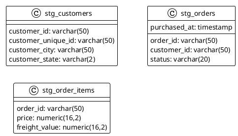

# Olist pipeline de dados com DBT

## Instruções para executar

Criar arquivo .env na raiz do projeto, conforme exemplo:

```yaml
KAGGLE_USERNAME={{kaggle_user}}
KAGGLE_KEY={{kaggle_key}}

DBT_DB_HOST=olist_db
DBT_DB_USER=admin
DBT_DB_PASS=admin
DBT_DB_PORT=5432
```
Executar o pipeline pelo docker-compose, através do comando ``docker-compose up --build``.

## Estrutura gerada
