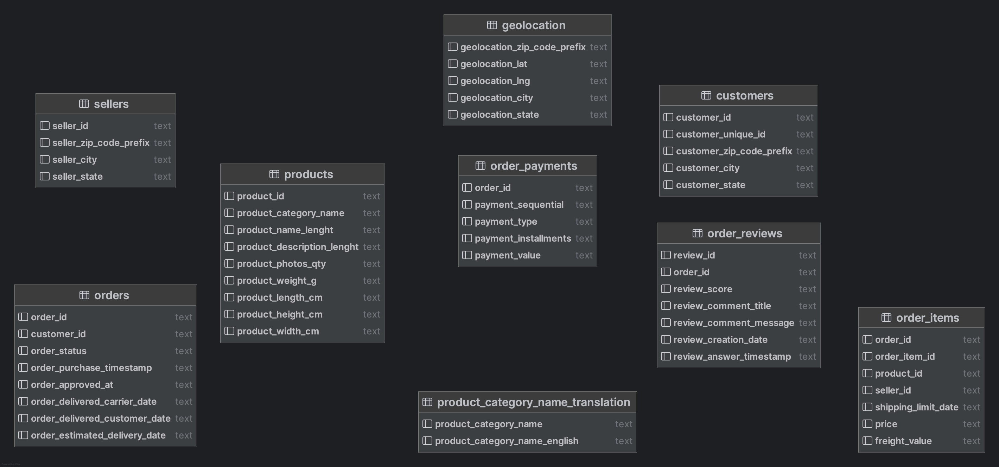
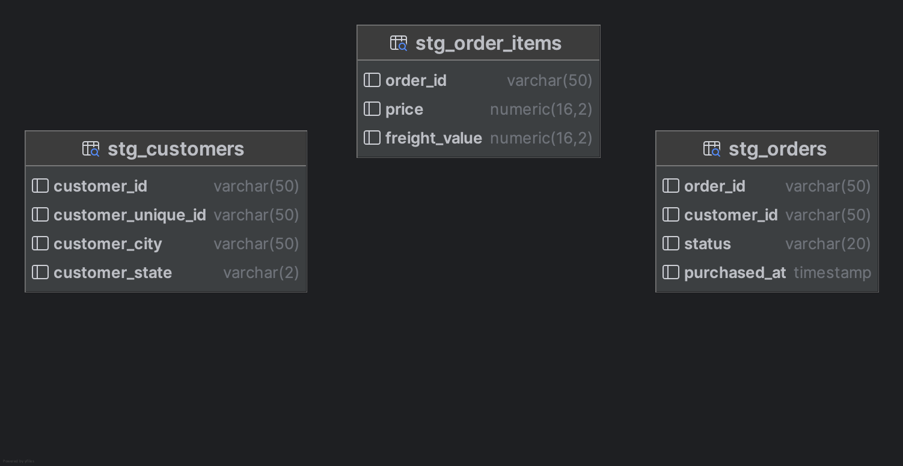
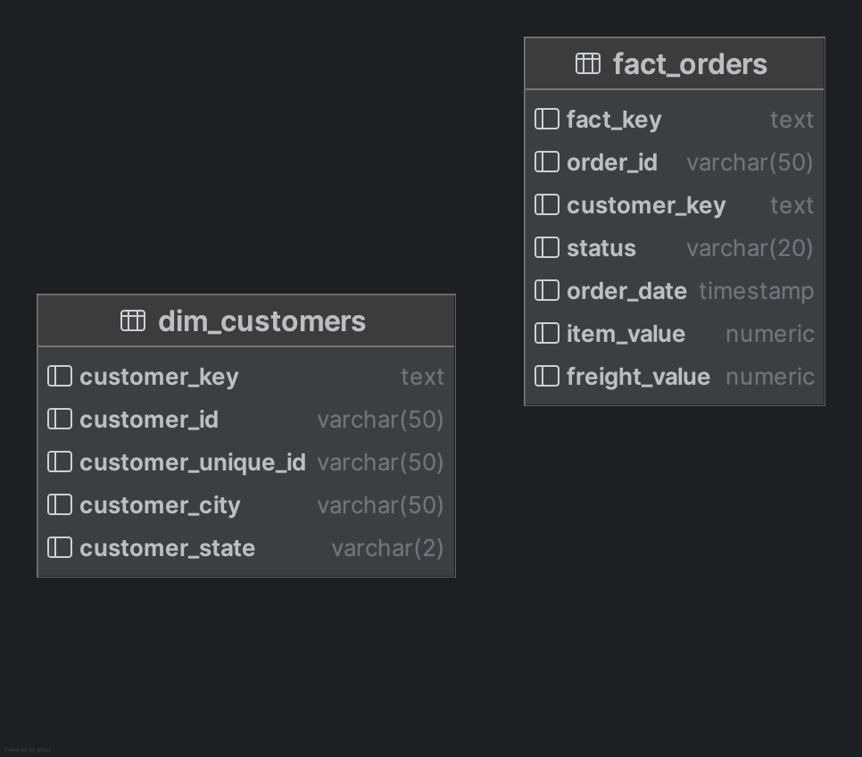
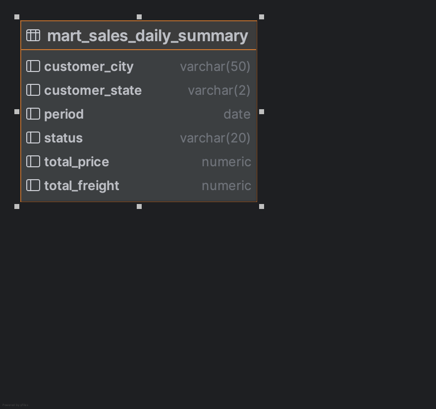
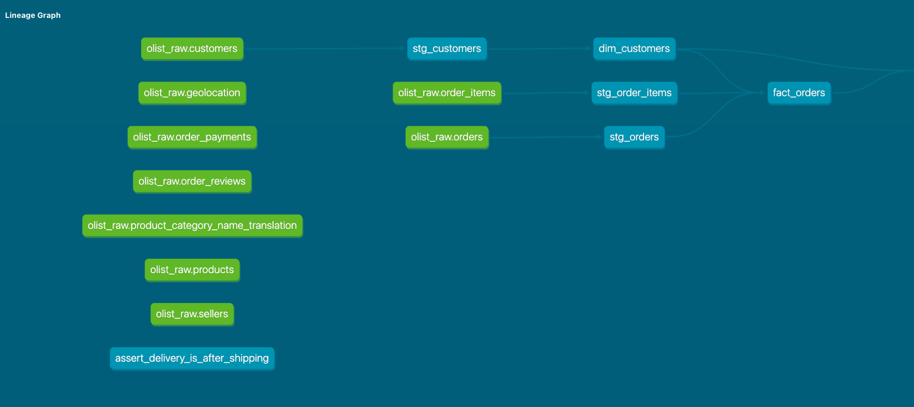

# Olist pipeline de dados com DBT

## Instruções para executar

Criar arquivo .env na raiz do projeto, conforme exemplo:

```yaml
KAGGLE_USERNAME={{kaggle_user}}
KAGGLE_KEY={{kaggle_key}}

DBT_DB_HOST=olist_db
DBT_DB_USER=admin
DBT_DB_PASS=admin
DBT_DB_PORT=5432
```
Executar o pipeline pelo docker-compose, através do comando ``docker-compose up --build``.

## Arquitetura completa do pipeline

### Camada Raw

Nessa camada, o conteúdo dos arquivos do dataset são salvos no schema _raw_ do DB. 
O conteúdo desses arquivos não é alterado. 
No banco, esses dados são salvos no schema `raw`.


### Camada Staging

Os dados da camada _raw_ que serão utilizados são limpos, transformados e salvos nessa camada. 
No banco de dados, os dados dessa camada são armazenados no schema `dbt`.



### Camada Silver

Nessa camada, é definida a tabela dimensão de `customers` e a tabela fato de vendas com valores calculados.
No banco de dados, os dados dessa camada são armazenados no schema `silver`.



### Camada Gold

Essa camada traz os dados mais relevantes para o negócio. 
No banco de dados, os dados dessa camada são armazenados no schema `gold`. 



### Gráfico de lineage
